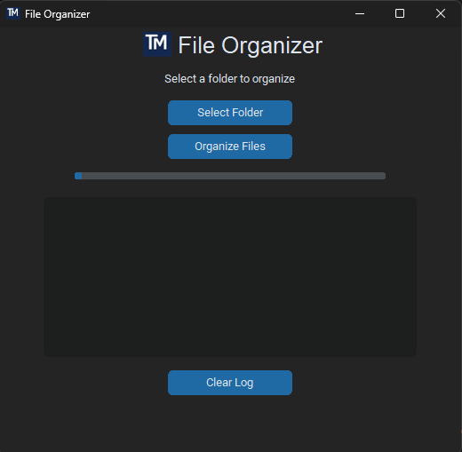

# File Organizer

A simple desktop utility that automatically organizes files in a folder by type.

Built with Python and CustomTkinter.

## Quick Download

Download the executable version:

➡ [Download EXE](../../releases/latest)

## Screenshot

## Features

- Modern GUI built with CustomTkinter
- Automatic file sorting
- Progress bar
- Operation log
- Clean user interface

## Supported file types

- Images
- Documents
- Music
- Videos
- Archives

## How to run

Install dependencies:

pip install customtkinter pillow

Run the application:

python main.py